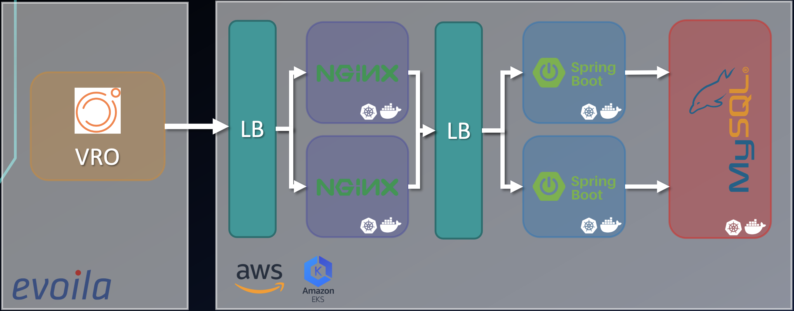
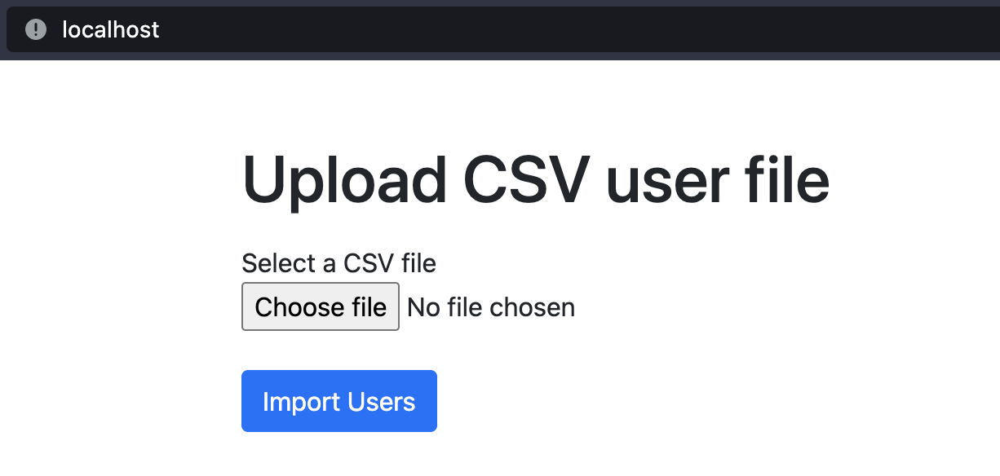

# Swisscom Titans Assessment

## Context

/!\ DISCLAIMER : This project was only for application purposes. So, these applications don't run on Swisscom infra.

---
### Goals

- According to the employees list given by HR team (csv file sent by email), automatically provide VMs for incoming workers and unprovide them for outcoming workers (IT & HR departments only)
- Process scheduled every 24h
- VM name format : “department-firstname-lastname”

### Big Picture

NB: It's actually the when it's deployed with k8s, with docker-compose you don't have load balancers and only one instance of each app.

### Project Hierarchy

- `assets/` : Readme assets
- `backend/` : Dockerfile (build + run) & spring boot backend application source code
- `env/` : Environment files of each app for docker-compose
- `frontend/` : Dockerfile & nginx template configuration (reverse proxy)
- `k8s/` : Master configuration (deployments + services) files for each app
- `users_lists/` : Ysers lists csv file
- `vro_package/` : Package (workflow + config) to import in vRO
- `docker-compose.yml` : Docker-compose configuration

## Workflow

### Upload employees list
The upload of the employees list is done on a front web (served by spring boot thymeleaf)

To access the web page, go to http://localhost:80/

Once done, you have the status of the upload and the summary of imported users in mysql database.

NB: The list you import erase all users already in database. (Employees who are still in the company will be again on the list).

### vRo (un)provision

// TODO

## Deployment

### docker-compose

`user@os swisscom-titans-assessment % docker-compose up -d`

#### Remove deployment
`user@os swisscom-titans-assessment % docker-compose down`

### Kubernetes

`user@os k8s % kubectl apply -f=master-backend.yaml,master-frontend.yaml,master-mysql.yaml`

#### Remove deployment
`user@os k8s % kubectl delete -f=master-backend.yaml,master-frontend.yaml,master-mysql.yaml`
